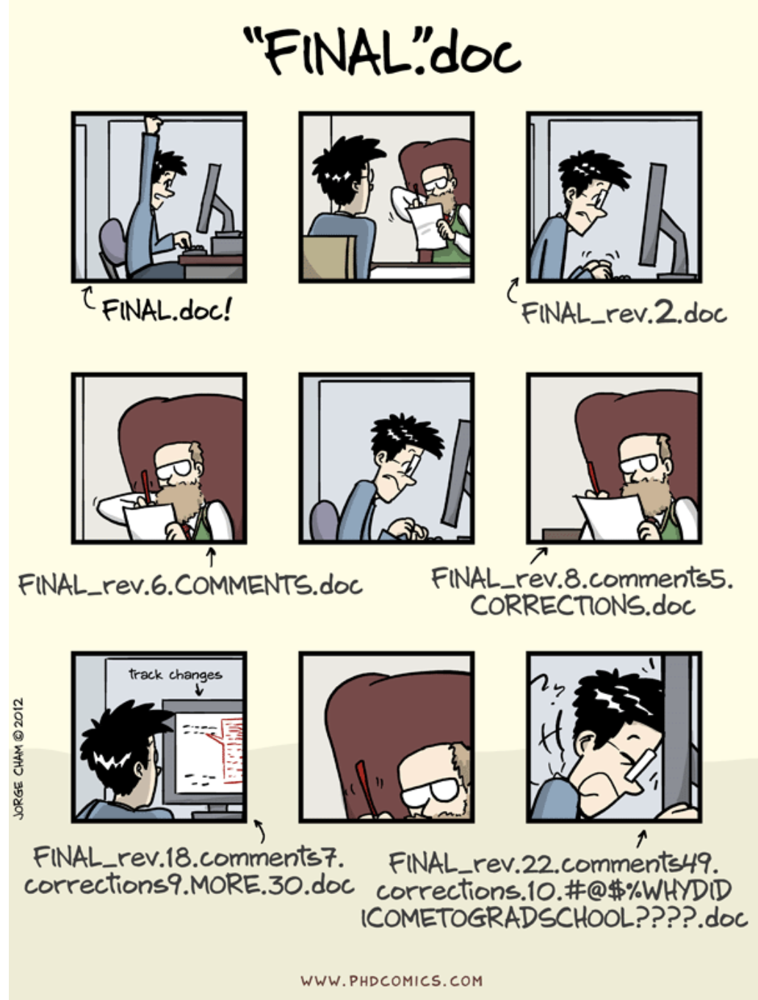
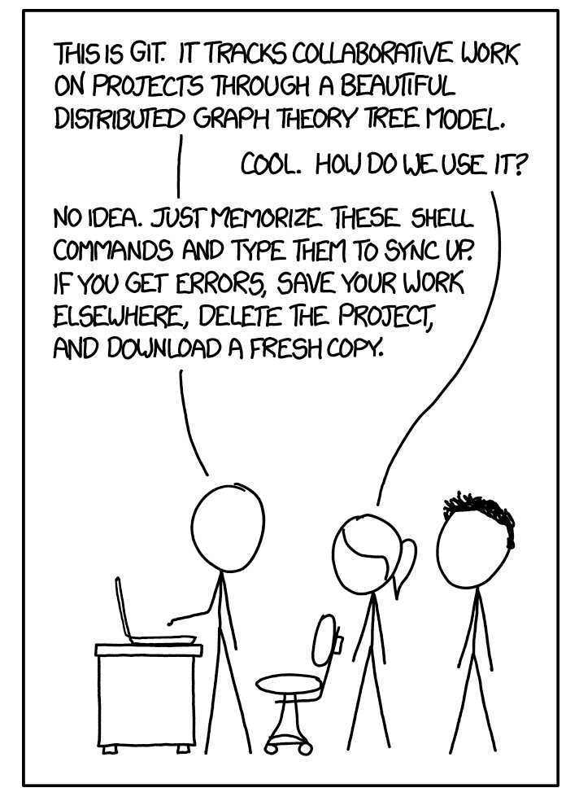

```{r setup, echo=FALSE}
library(knitr)
```

# Syllabus

## Course info
__Instructor__:  
Daniel McDonald  
Office: Myles Brand Hall E210C  
Website: https://dajmcdon.github.io/  
Slack: @dajmcdon  
Email: dajmcdon@indiana.edu  

__Office hours__:  
Me: TBA  
Joe: TBA  

__Course webpage__:    
WWW: https://stats-432sp2020.github.io/  
Github: https://github.com/stats-432sp2020  
Slack: https://Stat-432sp2020.slack.com/

__Lectures__:  
TR 4:00 - 5:15pm, BH 141  

__Textbook__:  
Required: [_Advanced Data Analysis from an Elementary Point of View_](https://www.stat.cmu.edu/~cshalizi/ADAfaEPoV/)  
Required: [_Introduction to Statistical Learning_](http://www-bcf.usc.edu/~gareth/ISL/)

__Prerequisite__:  
STAT-S 431 or equivalent or permission of the instructor.

## Course objective

This is a course in advanced data analysis. Based on the theory of
linear models covered in S431, this course will focus on applying many
types of data analysis methods to interesting datasets. The focus will
be dealing with and describing data rather than on particular methods
per se.

The course combines analysis with methodology and
computational aspects. It treats both the "art" of understanding
unfamiliar data and the "science" of analyzing that data in terms of 
statistical properties. The focus will be on practical aspects of methodology and intuition
to help students develop tools for selecting appropriate methods and
approaches to problems in their own lives. 

I expect that the material should be appropriate and interesting to
students coming from either statistics or informatics/computer
science. I will make an effort to provide necessary background so that
lectures are accessible to both populations.

We will put special emphasis on learning to use certain tools common to companies which actually _do_
data science. This includes [Slack](https://stat-432sp2020.slack.com/), [GitHub](https://github.com/STATS-432Sp2020), [Rstudio](https://www.rstudio.com), and [Rmarkdown](http://rmarkdown.rstudio.com/). As such, we will
require the use of these technologies.

## Lectures

Class time will consist of a
combination of lecture, discussion, questions and answers, and problem
solving, with a focus on problem solving. You are strongly encouraged
to bring a laptop to class.

## Textbook

We will use two books. Both are free online. The first is still in progress and subject to change, so you should download it somewhat frequently.

## Course communication

This class will use [Slack](https://stats-432sp2020.slack.com/) for class communication. Slack is a Team messaging
app which is frequently adopted by companies and research groups. We will use it for announcements, questions, 
homework communication, etc. You are required to use it. 

Since homework and the project are team-based, you need a way to communicate with your team. Slack is that way. You can
create a special channel for your team. You can direct message individuals. You can message me or the TA. You can post
pictures of cats. The sky is the limit. By using slack, we will avoid sending lots of email back and forth.

Slack has apps for iPhone or Android, Mac or Windows. Or you can use the web.

~~If you send me email instead, I may ignore it.~~

## Communication rules

- All content-related (non-personal) questions should be asked in [Slack](https://stats-432sp2020.slack.com/). Use the `general` channel for homework, lecture, or other questions. For personal issues, direct message me (@dajmcdon) or the TA.  
- Before posting a new question please make sure to check if your question has already been answered. Just search.  
- It may be more efficient to answer your question “in-person” so make good use of office hours (3 hours per week).  
- Emails will almost certainly be ignored.  
- I generally reply to messages during normal business hours (M-F). My typical response time is 24 hours. Please don't message me on Slack, wait an hour without response, email me, email me again, etc.  
- Ignoring these rules will result in decreased participation points.

## Grading

10 In-class exercises (5 points each)  
10 Reading responses (5 points each)  
6 Homeworks (25 points each)  
1 Course project (PC 1/PC 2/PC 3/Presentation 15/35/75/25)  
2 Take-home exams (150 points each)  
Participation (50 points)


In all cases, a fixed number of points may be __earned__ for each
exercise. Points are not deducted for poor performance in this
class. Points are awarded for excellent performance.


## In-class exercises

* We will regularly have short programming or theoretical exercises during class time.
* At the end of class, you will push your results to Github for grading.  
* Complete submissions will receive full credit.  
* Partial submissions will receive 2 points.  
* There will be at least 10 of these during the semester.  
* Any submissions you make in excess of 10 will be extra credit.

## Reading responses

* Each chapter will have a short coding exercise which you should submit before we cover the chapter. 
* I will post the exercise on Github, you clone it and upload your changes. 
* These will generally be due before class begins on __Tuesday__ each week. 
* Complete submissions will receive full credit. 
* Partial submissions will receive 2 points. 
* There will be at least 10 of these during the semester. 
* Any submissions you make in excess of 10 will be extra credit.

## Homeworks

* Homework assignments will be completed in groups which I assign. 
* These groups will rotate for each assignment.
* Each team will have their own private repository. 
* All assignments will be submitted on Github. 
* Homework grades
will be awarded based on complete and accurate analyses according to the rubric provided with each assignment.
* Grades will be adjusted up or down based on participation according to the Github commit messages. 
* You are
expected to consult only with me, the TA, or your assigned group, with the exception of conversations which occur
during class meetings or office hours in the presence of me or the TA. 
* ~~This means that you and your friend (who is in a different group) may not do the homework together.~~


## Project

* You will be required to complete a team project (2-4 people). 
* You may choose this group. 
* The goal is to analyze a dataset in depth using anything that you have learned. 
* The project will have three checkpoints: 
    1. PC 1 will be due __Thursday, January 30__, 
    2. PC 2 is due __Thursday, March 12__, 
    3. PC 3 is due on __Tuesday, May 5__. 
* All are to be uploaded to your repo by 11:59pm on those dates. 
* See the [project](https//stats-432sp2020.github.io/project.html) page for detailed requirements.
* The entire class will give brief presentations during the last week of classes. 

## Exams

* There will be two take home exams. 
* Both will be completed ~~entirely~~ individually. 
* The midterm will be made available on __Wednesday, Febuary 26__ for submission by __Wednesday, March 4__.
* The second exam will be available __Friday, April 17__ for submission by __Friday, April 24__. 
* In both cases, the exam file will be downloaded from your personal repo at 11:59pm on the due date. 
* Late submissions will not be accepted.

> If either of these dates pose some type of problem, you must notify me no later than Friday, January 17. After this date, no alternatives will be considered without medical documentation.

## Solutions

* Some of the problems that are assigned are similar or identical to those assigned in previous years
by me or other instructors for this or other courses. 
* Using proofs or
code from anywhere other than the textbooks (with attribution), this
year's course notes (with attribution), or the course website is not
only considered cheating 
(as described above), it is easily detectable cheating. 
* Such behavior is strictly forbidden.

## Cheating

* In previous years, I have caught students cheating on the exams. 
* I did not enforce any penalty because the action did not help. 
* Cheating, in my experience, occurs because students don't understand the material, so the result is usually a failing grade even before I impose any penalty and report the incident to the Dean's office. 
* I carefully structure exams to make it so that I can catch these issues. 
* I ~~will~~ catch you, and it does not help. 
* Do your own work, and use the TA and me as resources. 
* If you are struggling, we are here to help.

> If I suspect cheating, your case will be forwarded to the Dean's office. No questions asked.

# Github

## Acknowledgements

* Much of this lecture is borrowed/stolen from Colin Rundel and Karl Broman


## Why version control?

```{r, phd-comics, fig.align='center', echo=FALSE}

```

## Why version control?

* Simple formal system for tracking all changes to a project
* Time machine for your projects
    + Track blame and/or praise
    + Remove the fear of breaking things
* Learning curve is steep, but when you need it you REALLY need it

> Your closest collaborator is you six months ago, but you don’t reply to emails.
> -- _Paul Wilson_

## Why Git

* You could use something like Box or Dropbox
* These are poor-man's version control
* Git is much more appropriate
* It works with large groups
* It's very fast
* It's much better at fixing mistakes
* Tech companies use it (so it's in your interest to have some experience)

> This will hurt, but what doesn't kill you, makes you stronger.

## Set up

* Open Rstudio
* Go to the "Tools" menu and select "Shell"
* Type 

```
git --version
```

* If it's there, you're done, otherwise...

https://happygitwithr.com/install-git.html

## Tongue in cheek details while we pause for installation

```{r git-graph, echo=FALSE,fig.align='center'}

```


## Initial configuration

* Now tell it who your are:

```
$ git config --global user.name "Daniel McDonald"
$ git config --global user.email "dajmcdon@gmail.com"
$ git config --global core.editor nano
```

* `nano` is a light-weight text editor. You probably won't ever use it, but it's good to tell
git to use nano. If for some reason git asks you questions about doing things, just remember

> Ctrl + X is quit

(it says this at the bottom of the window)

* This is all that we will do with git in the terminal
* Rstudio has git built in, and so we'll use it through there mostly
* Using the terminal gives access to more complicated issues, which hopefully we won't have to deal with.


## Github

* This is a commercial site that interacts with Git (GitLab and Bitbucket do as well)
* You need a free account http://www.github.com/
* Git tracks changes to your files in both places
* Your files live in __repositories__ (repos in the lingo)
* You and others share access to repos

## When you want to work on a file

1. You __pull__ the repo onto your local machine
1. Make some changes
1. You __stage__ your changes by clicking the check boxes
1. You __commit__ your changes with a message, e.g.: "I fixed the horrible bug"
1. You continue to make changes + stage + commit with descriptive messages until you want to stop
1. You __push__ your changes back to the remote repo

## The hard way 

Git is pretty complicated

It is ~~very~~ versatile

Hopefully you won't need much of the versatility in this class

To use it, you need the command line or a better GUI client

## The easy way

* All the rest of the time, we'll just use Rstudio
* You clone a repo using Rstudio, make your changes, and push using Rstudio

## Syncing up with Rstudio

Demonstration:

1. Preferences > Git/svn 
2. If there is a key there, and you know when you made it/how to use it, skip to 4.
3. If empty, "Create"
4. "View public key", copy.
5. Github.com > Profile photo > Settings > SSH and GPG key > New SSH
6. Paste

Now you don't need your passphrase (from this computer)


## Slack

* We will use another service called [Slack](http://stats-432sp2020.slack.com/) for communication
* It is also free
* It is also common in industry
* It's just a way to send me, the TA, or your classmates messages
* This replaces the discussion board, announcements, etc on Canvas
* This way, you can talk to your team, you can talk to me, you can ask the class questions
* There are Android and iOS apps

## In class assignment 1

