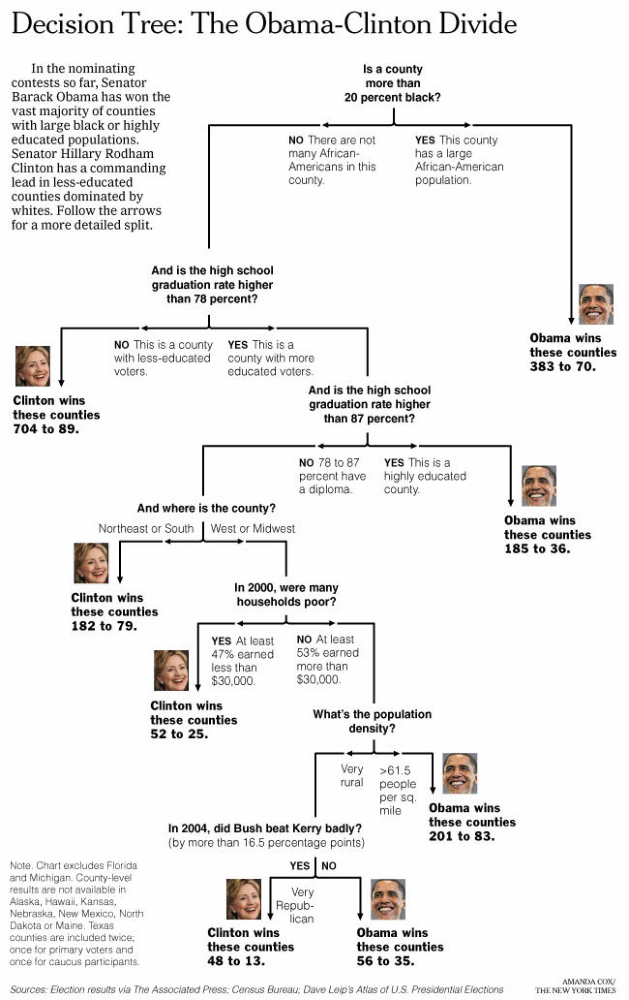
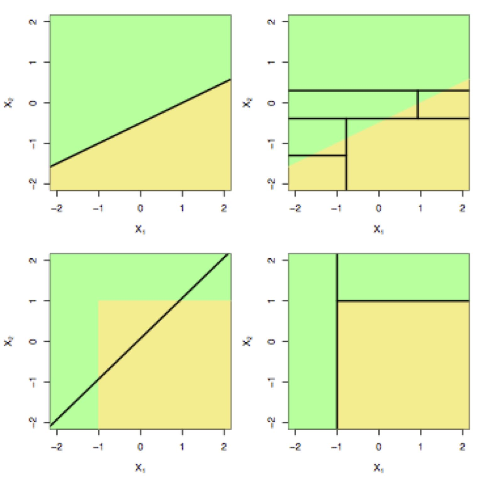

\newcommand{\Expect}[1]{\mathbb{E}\left[ #1 \right]}
\newcommand{\Var}[1]{\mathbb{V}\left[ #1 \right]}
\newcommand{\Cov}[2]{\mathrm{Cov}\left[#1,\ #2\right]}
\newcommand{\given}{\ \vert\ }
\newcommand{\E}{\mathbb{E}}
\renewcommand{\P}{\mathbb{P}}
\newcommand{\R}{\mathbb{R}}


```{r setup, echo=FALSE,message=FALSE}
library(knitr)
opts_chunk$set(message=FALSE, warning=FALSE, fig.align='center',fig.width=10,
               fig.height=6, cache=TRUE, autodep = TRUE)
library(tidyverse)
library(data.table)
theme_set(theme_minimal(base_family="Times"))
green = '#00AF64'
blue = '#0B61A4'
red = '#FF4900'
orange = '#FF9200'
```


## What is a (decision) tree?

* Trees involve stratifying or segmenting the predictor space into a number of simple regions.
* Trees are simple and useful for interpretation.  
* Basic trees are not great at prediction.
* More modern methods that use trees are much better.


## Example tree

```{r, echo=FALSE}

```


## Dendogram view

```{r data-processing, echo=FALSE}
states = read.csv('gfx/statelevel.csv')
national = read.csv('gfx/national.csv')
library(lubridate)
states$DATE = mdy(states$X)
national$DATE = ymd(national$DATE)
n = nrow(states)
states = states[-c((n-5):n),-1]
growth.rate = function(tseries, horizon=1){
  n = length(tseries)
  Y = tseries[(horizon+1):n]/tseries[1:(n-horizon)]
  Y = c(rep(NA,horizon), Y)
  return(Y-1)
}

national = mutate(national, 
                  term_spread = GS10-TB3MS,
                  sp500 = growth.rate(SP500, 3),
                  ind_prod = growth.rate(INDPRO, 3),
                  pay_emp = growth.rate(PAYEMS, 3),
                  fed_funds = FEDFUNDS,
                  y = factor(USREC)
)

X = full_join(national, states, by='DATE')
recessions = na.omit(select(X, DATE, term_spread:Wyoming))
rm(X,national,states)

train = 1:477 #through 1999
test  = 478:nrow(recessions)
```

```{r small-tree}
library(tree)
library(maptree)
small = na.omit(select(recessions, y, Maine, sp500))
out.tree.plt = tree(y~.,data=small)
  # I picked these to make an interesting small tree
tmp.tree = prune.tree(out.tree.plt,best=3)
draw.tree(tmp.tree)
```

 

~~Terminology~~

* We call each split or end point a node.  Each terminal node is referred to as a leaf.  
    * This tree has 1 interior node and 3 terminal nodes. 

* The interior nodes lead to branches.  
    * This graph has two main branches (the S\&P 500 split).


## Partitioning view

```{r}
small$yhat = predict(tmp.tree, type='class')
plot(small$sp500,small$Maine, col=c(red,blue)[small$y],
     pch=19,cex=.4,ylab='Maine',xlab='sp500',
     bty='n',las=1)
partition.tree(tmp.tree,add=TRUE,col=green)
```

~~Notes~~

* We classify all observations in a region the same.
* The three regions are the leaves of the tree.


## Tree

```{r}
par(mfrow=c(1,2))
draw.tree(tmp.tree)
plot(small$sp500,small$Maine, col=c(red,blue)[small$y],
     pch=19,cex=.4,ylab='Maine',xlab='sp500',
     bty='n',las=1)
partition.tree(tmp.tree,add=TRUE,col=green)
```


We can interpret this as 

* S\&P 500 is the most important variable.
* If S\&P 500 is large enough, then we predict no recession.
* If S\&P 500 is small enough, then we need to know the change
  in the Employment Level of Maine.


## When do trees do well?

```{r, echo=FALSE}

```

Top Row: A two-dimensional classification example in which the true decision boundary is linear. 
A linear boundary will outperform a decision tree that performs splits parallel to the axes.

Bottom Row: Here the true decision boundary is non-linear. A linear model is unable to capture the true decision boundary, whereas a decision tree is successful.


## How do we build a tree?


1. Divide the predictor space into
$J$ non-overlapping regions $R_1, \ldots, R_J$ (this is done via greedy, recursive binary splitting).

2. Every observation that falls into a given region $R_j$ is given the same prediction,
which is determined by majority (or plurality) vote in that region.


Important:

* Trees can only make rectangular regions that are aligned with the coordinate axis.
* The fit is ~~greedy~~, which means that after a split is made, all further decisions are conditional on that split.


# Does the tree fit?


## How do we measure quality of fit?


There are many choices for a metric.  Let $p_{mk}$ be the proportion of training observations in the $m^{th}$
region that are from the $k^{th}$ class.

| |  |
|---|---|
| ~~classification error rate:~~ | $E = 1 - \max_k (\widehat{p}_{mk})$|
| ~~Gini index:~~   | $G = \sum_k \widehat{p}_{mk}(1-\widehat{p}_{mk})$ |
| ~~cross-entropy:~~ | $D = -\sum_k \widehat{p}_{mk}\log(\widehat{p}_{mk})$|


Both Gini and cross-entropy can be thought of as measuring the purity of the classifier (small if all $p_{mk}$ are near zero or 1).  These are preferred over the classification error rate.


We build a classifier by growing a tree that minimizes $G$ or $D$.


## There's a problem

Following this procedure overfits!


* The process described so far will fit overly complex trees, leading to poor predictive performance.
* Overfit trees mean they have too many leaves.
* To stretch the analogy further, trees with too many leaves must be pruned.


## Pruning the tree


* Cross-validation can be used to directly prune the tree, but it is far too expensive (computationally) to use in practice (combinatorial complexity).

* Instead, we use `weakest link pruning', 
\[
\sum_{m=1}^{|T|} \sum_{i \in R_m} I(y_i = \widehat{y}_{R_m}) + \alpha |T|
\]
* $G = \sum_k \widehat{p}_{mk}(1-\widehat{p}_{mk})$: Gini index.  
where $|T|$ is the number of terminal nodes.  Essentially, we are trading training fit (first term) with model complexity (second) term (compare to lasso).
* Now, cross-validation can be used to pick $\alpha$.


## Results of trees on recession data


```{r tree-recession-estimation,warning=FALSE}
big.tree = tree(y~.-DATE,data=recessions,subset=train)
tree.cv = cv.tree(big.tree, K=5)
best.k = tree.cv$k[which.min(tree.cv$dev)]
tree = prune.tree(big.tree, k=best.k)
predclass = data.frame(truth = recessions$y[test])
predclass$tree = predict(tree, newdata = recessions[test,], type='class') ## for later
```

```{r}
par(mfrow=c(1,2),mar=c(0,0,0,0))
draw.tree(big.tree,cex=.4)
draw.tree(tree,cex=.5)
```

These trees were grown on the ~~training~~ data (from 1960 to 1999)  
Now, we use them to predict on the ~~test~~ data (from 2000 to 2011)


## Results of trees on recession data


```{r, warning=FALSE}
test_data = recessions[test,]
test_data$class = predict(tree, test_data, type='class')
test_data$prob = predict(tree, test_data, type='vector')[,2]
test_data = mutate(test_data, correct = class==y)
ggplot(test_data, aes(DATE, prob, color=correct)) + geom_point() + 
  scale_color_brewer(palette = 'Set1')
```


## Advantages and disadvantages of trees

+ Trees are very easy to explain (much easier than even linear regression).  

+ Some people believe that decision trees mirror human decision.  

+  Trees can easily be displayed graphically no matter the dimension of the data.

+ Trees can easily handle qualitative predictors without the need to create dummy variables.

- Trees aren't very good at prediction.

To fix this last one, we can try to grow many trees and average their performance. 


# Bagging


## Bagging

Many methods (trees included) tend to be designed to have lower bias but high variance.  

This means that if we split the training data into two parts at random and fit a decision tree to each part, the results could be quite different.


In contrast, a low variance estimator would yield similar results if applied repeatedly to distinct data sets (consider $\widehat{f} = 0$).


~~Bagging~~, also known as bootstrap aggregation, is a general purpose procedure for reducing variance. We'll use it specifically in the context of trees, but it can be applied much more broadly.


## Bagging: The main idea


Suppose we have $n$ uncorrelated observations $Z_1, \ldots, Z_n$, each with variance $\sigma^2$.


What is the variance of
\[
\overline{Z} = \frac{1}{n} \sum_{i=1}^n Z_i?
\]


More generally, if we have $B$ separate (uncorrelated) training sets, $1, \ldots, B$, we can form $B$ separate model fits, 
$\widehat{f}^1(x), \ldots, \widehat{f}^B(x)$, and then average them:
\[
\widehat{f}_{B}(x) = \frac{1}{B} \sum_{b=1}^B \widehat{f}^b(x)
\]


## Bagging: The bootstrap part

Of course, this isn't practical as having access to many training sets is unlikely.  We therefore
turn to the bootstrap to simulate having many training sets.


Suppose we have data $Z_1, \ldots, Z_n$ and we want to get an idea of the sampling
distribution of some statistic $f(Z_1,\ldots,Z_n)$.  Then we do the following

1. Choose some large number of samples, $B$. 
2. For each $b = 1,\ldots,B$, draw a new dataset from $Z_1, \ldots, Z_n$, call it 
$Z_1^*, \ldots, Z_n^*$. 
3. Compute $\widehat{f}_b^* = \widehat{f}(Z_1^*, \ldots, Z_n^*)$.


## Bagging: The bootstrap part

Now, instead of having $B$ separate training sets, we do $B$ bootstrap samples.
$\widehat{f}_1^{*}(x), \ldots, \widehat{f}_B^{*}(x)$, and then average them:
\[
\widehat{f}_{\textrm{bag}}(x) = \frac{1}{B} \sum_{b=1}^B \widehat{f}_b^{*}(x)
\]
This process is known as Bagging (bootstrap aggregation).


# Bagging trees


---

```{r,echo=FALSE}

```


## Bagging trees

The procedure for trees is the following


1. Choose a large number $B$.
2. For each $b = 1,\ldots, B$, grow an unpruned tree on the $b^{th}$ bootstrap draw from the data.
3. Average all these trees together.


Each tree, since it is unpruned, will have (low/high) variance and
(low/high) bias.

Therefore averaging many
trees results in an estimator that has lower variance and still
low bias.


Caveat: Be careful bootstrapping time series data.


## Bagging trees: Variable importance measures


Though bagging can improve predictive performance of trees, the trade-off is we sacrificed some
interpretability. 

We no longer have that nice diagram that shows the segmentation of the predictor space (or, more accurately, we have $B$ of them).  


To recover some information, we can do the following:

1. For each of the $b$ trees and each of the $p$ variables, we record the amount that the Gini index is reduced
by the addition of that variable 
2. Report the average reduction over all $B$ trees.


## Bagging trees: Variable importance measures

```{r, fig.show='hide'}
library(randomForest)
rf = randomForest(y~.-DATE, data=recessions, subset=train)
predclass$rf = predict(rf, test_data)
bag = randomForest(y~.-DATE,data=recessions, subset=train, mtry=ncol(recessions)-2)
predclass$bag = predict(bag, test_data)
out = varImpPlot(rf)
```

```{r, better-importance}
dfout = data.frame(variable=rownames(out), out)
ggplot(dfout[1:25,],aes(MeanDecreaseGini,reorder(variable,MeanDecreaseGini))) + 
  geom_point(color=red) + ylab('variable') + xlab('Mean Decrease Gini')
```


## Random Forest

Random Forest is a small extension of Bagging, in which the bootstrap trees are decorrelated.  


The idea is, we draw a bootstrap sample and start to build a tree. 

* At each split, we randomly select
$m$ of the possible $p$ predictors as candidates for the split. 
* A new sample of size $m$ of the predictors is taken at each split. 
   


Usually, we use about $m = \sqrt{p}$ 

(this would be 7 out of 56 predictors for GDP data).


In other words, at each split, we aren't even allowed to consider the majority of possible predictors!


## Random Forest

What is going on here?


Suppose there is 1 really strong predictor and many mediocre ones. 


* Then each tree will have this one predictor in it,
* Therefore, each tree will look very similar (i.e. highly correlated).  
* Averaging highly correlated things leads to much less variance reduction than if they were uncorrelated.

If we don't allow some trees/splits to use this important variable, each of the trees will be much less similar and
hence much less correlated.


Bagging Trees is Random Forest when $m = p$, that is, when we can consider all the variables at each split.


## Reporting results

There are two main ways classification results are reported:


* Sensitivity/specificity
* Confusion matrix


## Reporting results: Sensitivity/specificity


~~Sensitivity:~~  The proportion of times we label 'recession', given 
                 that 'recession' is the correct answer. 
                  (True $+$)  
~~Specificity:~~  The proportion of times we label 'no recession', given
                 that 'no recession' is the correct answer. 
                  (True $-$) 


We can think of this in terms of hypothesis testing.  If
\[
H_0: \textrm{ no recession},
\]
then 

~~Sensitivity:~~  $P(\textrm{reject } H_0 | H_0 \textrm{ is false})$, that is: 1 - $P$(Type II error)  
~~Specificity:~~  $P(\textrm{accept } H_0 | H_0 \textrm{ is true})$, that is: 1 - $P$(Type I error) 


## Tree results: Confusion matrices

```{r,include=TRUE}
predclass$null = rep(0,length(test))
long = gather(predclass, key='predictor', value='class', -truth)
fun = function(x) table(x$class, x$truth)
library(kableExtra)
tab = plyr::ddply(long, ~predictor, fun)
tab$prediction = c(0,1,0,0,1,0,1)
kable(tab[,c(4,2,3)], 'html') %>% group_rows('bagging', 1,2) %>% 
  group_rows('null', 3,3) %>%
  group_rows('random forest',4,5) %>% group_rows('tree',6,7)
```

## Tree results: Sensitivity and Specificity

```{r}
sense = function(pred,truth){
  mat = table(pred,truth)[,2]
  mat[2]/sum(mat)
}
spec = function(pred,truth){
  mat = table(pred,truth)[,1]
  mat[1]/sum(mat)
}
sstab = ddply(long, ~predictor, summarise, 
              sensitivity = sense(class,truth),
              specificity = spec(class,truth)
)
kable(sstab, digits = 3)
```

## Results of Bagging on recession data


```{r}
test_data = recessions[test,]
test_data$class = predclass$bag
test_data$prob = predict(bag, test_data, type='prob')[,2]
test_data = mutate(test_data, correct = class==y)
ggplot(test_data, aes(DATE, prob, color=correct)) + geom_point() + 
  scale_color_brewer(palette = 'Set1')
```


## Out-of-Bag error estimation (OOB)

One can show that, on average, drawing $n$ samples from $n$ observations with replacement (also known as bootstrap) results in about 2/3 of the observations being selected.


The remaining one-third of the observations not used are referred to as ~~out-of-bag (OOB)~~.


We can think of it as a for-free cross-validation.  


Each time a tree is grown, we can get its prediction error on the unused observations.  We average this over all bootstrap samples.


## Out-of-bag error estimation for bagging

```{r}
tab = table(predict(bag),recessions$y[train])
kable(tab)
sum(diag(tab))/sum(tab)
```


## Classification recap

There are many, many different classification algorithms.


Different methods will work bettter in different situations.

~~Linear:~~          Logisitic regression,
 linear discriminant analysis (LDA),  
 GLMNET, separating hyperplanes 
 
~~Non-linear:~~  quadratic discriminant analysis (QDA),
 trees (and associated methods), 
 K-nearest neighbors (KNN)
 Support vector machines (SVM) 
 Neural networks 
